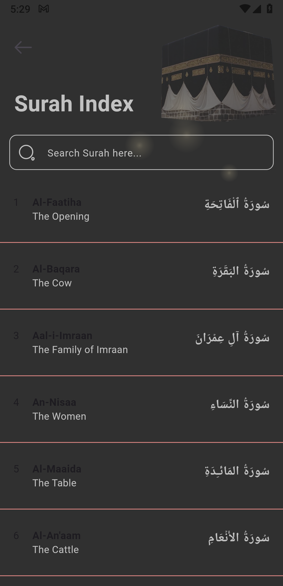

# 📖 Holy Quran App (Flutter)

A modern mobile application built with **Flutter & Dart** that empowers users to explore, read, listen to and engage with the Holy Quran. This app offers clean design, offline support, smooth audio recitation, translations, search, bookmarking and more — making it a complete companion for both casual reading and deeper study.

---

## ✨ Key Features

- 📚 Full Quran Text – All 114 Surahs and 30 Juz available for reading.  
- 🔍 Search & Navigation – Easily find Surahs or Ayahs with search functionality.  
- 🔖 Bookmark & Last-Read – Quickly return to your last read or saved verse.  
- 🔊 Audio Recitation – Listen to beautiful recitations, with smooth playback controls.  
- 🌙 Theme Support – Switch between light/dark mode for better reading comfort.  
- 🗂 Translations & Tafsir – Includes translations in multiple languages and optional commentary (if supported).  
- 📴 Offline Mode – Download Surahs or content for offline reading/listening (if implemented).  
- 🧩 Clean Architecture & Scalability – Built with modular structure, state management and best practices for maintainability.

---

## 🖼 App Screenshots

<p align="center">
  
  
  
  
  
  
  
  
  
  
  
  
  
  
  
  
  
  
  
  
  
  
  
  
  
</p>


---

## 🛠 Tech Stack & Architecture

- **Framework:** Flutter  
- **Language:** Dart  
- **State Management:** Provider / BLoC / setState (depending on implementation)  
- **Local Storage:** SQLite / Hive / Shared Preferences for bookmarks, last-read etc.  
- **Media Playback:** Audio player plugin (for recitations)  
- **Offline Support:** Cache downloaded Surahs or media for offline use  
- **Architecture:** Clean architecture with separation of UI, business logic and data layers  

---

## 📂 Project Structure
```bash
├── lib/                   (Dart source code)
│   ├── animations/        (Custom animation widgets)
│   │   ├── bottom_animation.dart
│   │   └── entrance_fader.dart
│   ├── configs/           (App-wide configurations like themes, dimensions)
│   │   ├── app.dart
│   │   ├── app_core_theme.dart
│   │   ├── app_dimensions.dart
│   │   ├── app_theme.dart
│   │   ├── app_typography.dart
│   │   ├── app_typography_ext.dart
│   │   ├── configs.dart
│   │   ├── core_theme.dart
│   │   ├── space.dart
│   │   ├── space_ext.dart
│   │   ├── ui.dart
│   │   └── ui_props.dart
│   ├── cubits/            (Bloc/Cubit for state management)
│   │   ├── bookmarks/     (Bookmarks specific cubit, data provider, state)
│   │   │   ├── cubit.dart
│   │   │   ├── data_provider.dart
│   │   │   └── state.dart
│   │   ├── chapter/       (Chapter specific cubit, data provider, repository, state)
│   │   │   ├── cubit.dart
│   │   │   ├── data_provider.dart
│   │   │   ├── repository.dart
│   │   │   └── state.dart
│   │   ├── juz/           (Juz specific cubit, data provider, repository, state)
│   │   │   ├── cubit.dart
│   │   │   ├── data_provider.dart
│   │   │   ├── repository.dart
│   │   │   └── state.dart
│   │   └── ...            (Other domain-specific cubits)
│   ├── models/            (Data models and generated files)
│   │   ├── ayah/
│   │   │   ├── ayah.dart
│   │   │   └── ayah.g.dart
│   │   ├── chapter/
│   │   │   ├── chapter.dart
│   │   │   └── chapter.g.dart
│   │   ├── juz/
│   │   │   ├── juz.dart
│   │   │   └── juz.g.dart
│   │   └── ...            (Other data models)
│   ├── providers/         (Global providers, e.g., app settings, onboarding status)
│   │   ├── app_provider.dart
│   │   └── onboarding_provider.dart
│   ├── screens/           (UI screens for different parts of the app)
│   │   ├── bookmarks/
│   │   │   └── bookmarks_screen.dart
│   │   ├── home/
│   │   │   ├── widgets/
│   │   │   │   ├── bottom_ayah.dart
│   │   │   │   ├── custom_drawer.dart
│   │   │   │   └── main_screen.dart
│   │   │   └── home_screen.dart
│   │   ├── juz/
│   │   │   └── juz_index_screen.dart
│   │   ├── onboarding/
│   │   │   ├── widgets/
│   │   │   │   ├── indicator.dart
│   │   │   │   ├── onboarding_page.dart
│   │   │   │   └── onboarding.dart
│   │   │   └── onboarding_screen.dart
│   │   ├── page/
│   │   │   └── page_screen.dart
│   │   ├── share_app/
│   │   │   ├── widgets/
│   │   │   │   └── share_custom_button.dart
│   │   │   └── share_app.dart
│   │   ├── splash/
│   │   │   └── splash.dart
│   │   ├── surah/
│   │   │   ├── widgets/
│   │   │   │   ├── surah_app_bar.dart
│   │   │   │   ├── surah_information.dart
│   │   │   │   └── surah_tile.dart
│   │   │   └── surah_index_screen.dart
│   │   └── ...            (Other feature-specific screens)
│   ├── utils/             (Utility functions, constants, helper classes)
│   │   ├── assets.dart    (Asset paths and management)
│   │   ├── drawer.dart
│   │   ├── juz.dart
│   │   └── links.dart
│   └── widgets/           (Reusable UI components across the app)
│       ├── app/           (App-level widgets like app name, version)
│       │   ├── app_name.dart
│       │   ├── app_version.dart
│       │   └── title.dart
│       ├── button/        (Custom buttons)
│       │   ├── app_back_button.dart
│       │   └── app_button.dart
│       ├── loader/        (Loading indicators)
│       │   └── loading_shimmer.dart
│       ├── calligraphy.dart
│       ├── custom_image.dart
│       ├── flare.dart
│       ├── quran_rail.dart
│       └── ...            (Other common widgets)
│   ├── app_routes.dart    (For navigation routing)
│   ├── main.dart          (Main entry point of the app)
│   └── share_icon_icons.dart (Custom icon definitions)

```
---


## 🚀 Getting Started

### Prerequisites  
Make sure you have Flutter SDK installed.  
[Flutter installation guide →](https://flutter.dev/docs/get-started/install)

### Installation  

## 1. Clone repository
```bash
git clone https://github.com/NoorMustafa4556/Holy-Quran-App-Flutter.git
```

## 2. Navigate to the directory
```bash
cd Holy-Quran-App-Flutter
```

## Install dependencies
```bash
flutter pub get
```
## 3. Run on device/emulator
```bash
flutter run
```
# 👋🏻 Hi, I'm Noor Mustafa

A passionate and results-driven *Flutter Developer* from *Bahawalpur, Pakistan, specializing in building elegant, scalable, and high-performance cross-platform mobile applications using **Flutter* and *Dart*.

With a strong understanding of *UI/UX principles, **state management, and **API integration*, I aim to deliver apps that are not only functional but also user-centric and visually compelling. My development approach emphasizes clean code, reusability, and performance.

---

## 🚀 What I Do

- 🧑🏻💻 *Flutter App Development* – I build cross-platform apps for Android, iOS, and the web using Flutter.
- 🔗 *API Integration* – I connect apps to powerful RESTful APIs and third-party services.
- 🎨 *UI/UX Design* – I craft responsive and animated interfaces that elevate the user experience.
- 🔐 *Authentication & Firebase* – I implement secure login systems and integrate Firebase services.
- ⚙ *State Management* – I use Provider, setState, and Riverpod (in-progress) for scalable app architecture.
- 🧠 *Clean Architecture* – I follow MVVM and MVC patterns for maintainable code.

---


## 🌟 Projects I'm Proud Of

- 🌤 **[Live Weather Check App](https://github.com/NoorMustafa4556/Live-Weather-Check-App)** – Real-time weather forecast using OpenWeatherMap API  
- 🤖 **[AI Chatbot (Gemini)](https://github.com/NoorMustafa4556/Ai-ChatBot)** – Conversational AI chatbot powered by Google’s Gemini  

- 🍔 **[Recipe App](https://github.com/NoorMustafa4556/Recipe-App)** – Discover recipes with images, categories, and step-by-step instructions  

- 📚 **[Palindrome Checker](https://github.com/NoorMustafa4556/Palindrome-Checker-App)** – A Theory of Automata-based project to identify palindromic strings  

> 🎯 Check out all my repositories on [github.com/NoorMustafa4556](https://github.com/NoorMustafa4556?tab=repositories)

---

## 🛠 Tech Stack & Tools

| Area                | Tools/Technologies |
|---------------------|--------------------|
| *Languages*       | Dart, JavaScript, Python (basic) |
| *Mobile Framework*| Flutter            |
| *Backend/Cloud*   | Firebase (Auth, Realtime DB, Storage), Django, Flask |
| *Frontend (Web)*  | React.js (basic), HTML, CSS, Bootstrap |
| *State Management*| Provider, setState, Riverpod (learning) |
| *API & Storage*   | REST APIs, HTTP, Shared Preferences, SQLite |
| *Design*          | Material, Cupertino, Lottie Animations, Gradient UI |
| *Version Control* | Git, GitHub        |
| *Tools*           | Android Studio, VS Code, Postman, Figma (basic) |

---

## 🧰 Tech Toolbox

<p align="left">
  
  
  
  
  
  
  
  
</p>

---

## 📈 Current Focus

- 💡 Enhancing Flutter animations and transitions
- 🤖 Implementing AI-based logic with Google Gemini API
- 📲 Building portfolio-level applications using full-stack Django & Flutter

---

## 📫 Let's Connect!

<p align="left">
  <a href="https://x.com/NoorMustafa4556" target="blank">
    
  </a>
  <a href="https://www.linkedin.com/in/noormustafa4556/" target="blank">
    
  </a>
  <a href="https://www.facebook.com/NoorMustafa4556" target="blank">
    
  </a>
  <a href="https://instagram.com/noormustafa4556" target="blank">
    
  </a>
  <a href="https://wa.me/923087655076" target="blank">
    
  </a>
  <a href="https://www.tiktok.com/@noormustafa4556" target="blank">
    
  </a>
</p>

- 📍 *Location:* Bahawalpur, Punjab, Pakistan

---

> “Learning never stops. Every app I build makes me a better developer — one widget at a time.”

---
